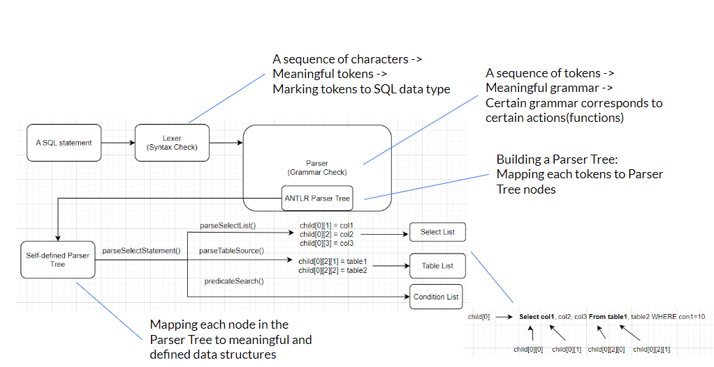

## SQL Parser

This repository contains the source code for the CapybaraDB's Command Processor Layer (CPL). It corresponds to a SQL
parser component find in most Database Management
System (DBMS). The CPL is designed to handle SQL statements and convert them into a parse tree for further processing.
This parser is built using the ANTLR4 tool - a powerful parser generator.

## File Structure

```
SQL_parser_new
├── 0001-added-logic-exe-not-approaching-exe-from-parser-tree.patch
├── CMakeLists.txt
├── MySqlLexer.g4
├── MySqlParser.g4
├── README.md
├── antlr-4.13.0-complete.jar
├── cmake
├── Google_tests
│   ├── lib
│   ├── CMakeLists.txt
│   ├── testOptimization.cpp
│   ├── testParser.cpp
├── executor
│   ├── CapybaraMasterTable
│   │   ├── Table
│   │   │   ├── Column
│   │   │   │   ├── column.cc
│   │   │   │   └── column.h
│   │   │   ├── table.cc
│   │   │   └── table.h
│   │   ├── capybara.cc
│   │   └── capybara.h
│   ├── IntegrityChecker
│   │   ├── DdlConstraints.cpp
│   │   ├── DdlConstraints.h
│   │   ├── IntegrityChecker.cpp
│   │   ├── IntegrityChecker.h
│   │   ├── IntegrityConstraint
│   │   │   ├── include
│   │   │   │   ├── ForeignKeyConstraint.h
│   │   │   │   ├── IntegrityConstraint.h
│   │   │   │   ├── IntegrityConstraintType.h
│   │   │   │   ├── NotNullConstraint.h
│   │   │   │   ├── PrimaryKeyConstraint.h
│   │   │   │   ├── TypeConstraint.h
│   │   │   │   └── UniqueKeyConstraint.h
│   │   │   └── src
│   │   │       ├── ForeignKeyConstraint.cpp
│   │   │       ├── IntegrityConstraint.cpp
│   │   │       ├── NotNullConstraint.cpp
│   │   │       ├── PrimaryKeyConstraint.cpp
│   │   │       ├── TypeConstraint.cpp
│   │   │       └── UniqueKeyConstraint.cpp
│   │   └── IntegrityConstraintCheckResult
│   │       └── IntegrityConstraintCheckResult.h
│   ├── SqlExecutor
│   │   ├── DdlExecutor
│   │   │   ├── CreateDBExecutor.cpp
│   │   │   ├── CreateTableExecutor.cpp
│   │   │   ├── DropDBExecutor.cpp
│   │   │   ├── DropTableExecutor.cpp
│   │   │   ├── ShowDatabasesExecutor.cpp
│   │   │   ├── ShowTablesExecutor.cpp
│   │   │   └── UseDBExecutor.cpp
│   │   └── DmlExecutor
│   │       ├── DeleteExecutor.cpp
│   │       ├── InsertExecutor.cpp
│   │       ├── SelectExecuter.cpp
│   │       └── UpdateExecutor.cpp
│   ├── evaluator.cpp
│   ├── evaluator.h
│   ├── index.cc
│   ├── index.h
│   ├── result.cc
│   └── result.h
├── external_dependencies.cmake
├── generate.cmd
├── generated
│   ├── MySqlLexer.cpp
│   ├── MySqlLexer.h
│   ├── MySqlLexer.interp
│   ├── MySqlLexer.tokens
│   ├── MySqlParser.cpp
│   ├── MySqlParser.h
│   ├── MySqlParser.interp
│   ├── MySqlParser.tokens
│   ├── MySqlParserBaseListener.cpp
│   ├── MySqlParserBaseListener.h
│   ├── MySqlParserBaseVisitor.cpp
│   ├── MySqlParserBaseVisitor.h
│   ├── MySqlParserListener.cpp
│   ├── MySqlParserListener.h
│   ├── MySqlParserVisitor.cpp
│   └── MySqlParserVisitor.h
├── main.cpp
├── parserTree
│   ├── MyListener
│   │   ├── MyListener.cpp
│   │   └── MyListener.h
│   ├── SQLStatement
│   │   ├── DDLStatement
│   │   │   ├── DdlStatement.cpp
│   │   │   ├── DdlStatement.h
│   │   │   ├── include
│   │   │   │   ├── CreateDbStatement.h
│   │   │   │   ├── CreateTableStatement.h
│   │   │   │   ├── DropDbStatement.h
│   │   │   │   ├── DropTableStatement.h
│   │   │   │   ├── ShowDatabases.h
│   │   │   │   ├── ShowTables.h
│   │   │   │   └── UseDBStatement.h
│   │   │   └── src
│   │   │       ├── CreateDbStatement.cpp
│   │   │       ├── CreateTableStatement.cpp
│   │   │       ├── DropDbStatement.cpp
│   │   │       ├── DropTableStatement.cpp
│   │   │       ├── ShowTables.cpp
│   │   │       └── UseDBStatement.cpp
│   │   ├── DMLStatement
│   │   │   ├── DmlStatement.cpp
│   │   │   ├── DmlStatement.h
│   │   │   ├── include
│   │   │   │   ├── DeleteStatement.h
│   │   │   │   ├── InsertStatement.h
│   │   │   │   ├── Join.h
│   │   │   │   ├── SelectStatement.h
│   │   │   │   └── UpdateStatement.h
│   │   │   └── src
│   │   │       ├── DeleteStatement.cpp
│   │   │       ├── InsertStatement.cpp
│   │   │       ├── Join.cpp
│   │   │       ├── SelectStatement.cpp
│   │   │       └── UpdateStatement.cpp
│   │   ├── SqlStatement.cpp
│   │   └── SqlStatement.h
│   ├── include
│   │   ├── Condition.h
│   │   ├── Element.h
│   │   ├── Operator.h
│   │   ├── ParserTree.h
│   │   └── ParserTreeNode.h
│   └── src
│       ├── Condition.cpp
│       ├── Element.cpp
│       ├── Operator.cpp
│       ├── ParserTree.cpp
│       └── ParserTreeNode.cpp
├── queryOptimization
│   ├── LogicMinimizationOptimizer.cpp
│   ├── LogicMinimizationOptimizer.h
│   ├── Optimizer.cpp
│   ├── Optimizer.h
│   ├── qm.cc
│   └── qm.hh
├── run_cmake_and_tests.py
├── run_tests_for_students.py
├── runtime
│   ├── CMakeLists.txt
│   ├── antlr4cpp-vs2019.vcxproj
│   ├── antlr4cpp-vs2019.vcxproj.filters
│   ├── antlr4cpp-vs2022.vcxproj
│   ├── antlr4cpp-vs2022.vcxproj.filters
│   ├── antlrcpp-ios
│   ├── antlrcpp.xcodeproj
│   ├── nuget
│   ├── src
│   └── tests
├── sql
│   ├── createDropDBStatement.sql
│   ├── insertData.sql
│   ├── selectWhere.sql
│   └── testIntegrityConstraintCheck.sql
├── testSelect.cpp
└── test_table.csv
```

## Program Flow



## Main Files in Detail

### ParserTree.cpp

The ParserTree class provides essential functions for constructing and manipulating the parse tree. It contains a
pointer to the root node of the tree, which can be accessed using the getRootNode() method. The constructor of the
ParserTree class initializes the root node with a new ParserTreeNode.

In the context of the SQL parser, the parse() method is expected to process the ANTLR4 tree::ParseTree object,
representing the parse tree of the SQL statement. While the current implementation only outputs a debug message, this
method will be further developed to handle the parsing of SQL statements and construct the appropriate parse tree nodes.

The printTree() method is responsible for displaying the contents of the parse tree. However, its implementation is
minimal at the moment, merely printing a debug message. Future enhancements will include a comprehensive traversal of
the parse tree, allowing developers to visualize the structure of parsed SQL statements.

The ParserTree.cpp file serves as a crucial building block for the SQL parser component, facilitating the construction
and management of parse trees, which are fundamental for processing and interpreting SQL queries effectively.

For detailed instructions on utilizing the ParserTree class and incorporating it into your project, please refer to the
main readme of the repository. If you have any questions or require support regarding the ParserTree.cpp file or the SQL
parsing functionality, please don't hesitate to contact the project maintainers or consult the contribution guidelines
provided in the main readme.

### ParserTreeNode.cpp

The ParserTreeNode class represents a node in the parse tree, encapsulating information about its type, parent node, and
child nodes. The constructor of the class initializes the node with default values, setting the parent node as nullptr,
the node type as -1, and an empty vector to store the child nodes.

The class provides various essential methods for interacting with the parse tree. The getNodeType() method retrieves the
type of the node, while getParentNode() returns a pointer to the parent node. The getChildrenNodes() method retrieves a
vector containing pointers to all the child nodes of the current node.

The class also includes methods to modify the node and its relationships within the parse tree. The setNodeType() method
allows setting the node type, and the setParentNode() method establishes the parent-child relationship with another
ParserTreeNode as the parent node. The addChildNode() method is used to add a child node to the current node, and
conversely, the deleteChildNode() method is responsible for removing a specified child node from the current node.
Additionally, the deleteNode() method allows deleting the current node from the parse tree, adjusting its parent node
accordingly. Lastly, the moveNode() method facilitates moving the current node to a new parent node within the parse
tree.

The class destructor takes care of cleaning up memory by deleting all child nodes when a ParserTreeNode object is
destroyed.

The ParserTreeNode.cpp file plays a crucial role in managing the structure and relationships of nodes within the parse
tree, which is essential for the effective parsing and interpretation of SQL statements.

=======

## Main Files in Detail

### main.cpp

This file, main.cpp, is a crucial part of the SQL parser component of our Database Management System (DBMS). The main
objective of this component is to parse SQL statements and generate a parse tree representation for further processing.
The parser is built using the ANTLR4 tool, which is a robust parser generator.

The ParseStatement() function in this file handles user input and parsing of SQL statements. When the program is
executed, it prompts the user to input a SQL statement, which is then converted into a parse tree using ANTLR4's
generated lexer and parser classes (MySqlLexer and MySqlParser, respectively). The resulting parse tree is displayed,
showing the syntactic structure of the SQL statement. Subsequently, the parser attempts to interpret and execute the
statement. If any syntax errors are detected, they are reported to the user.

Currently, the parser supports basic SQL statements such as SELECT, INSERT, UPDATE, DELETE, and CREATE TABLE.
Additionally, it handles simple aggregate functions like AVG(), COUNT(), SUM(), MAX(), and MIN(). However, more advanced
functionalities and complex SQL constructs are planned for future updates.

This component is an essential part of the DBMS, enabling it to interact with SQL queries effectively. Developers can
use this parser to integrate SQL capabilities into their applications seamlessly. The code is designed to be extensible
and contributions are welcome. For any questions or support related to this component, please refer to the license and
contribution guidelines provided in the main readme of the repository.

=======

### generate.cmd

The generate.cmd script is an essential step in ensuring that the required ANTLR4-generated source files are available
in the "generated" subfolder. These files play a critical role in enabling the demo project to compile successfully and
effectively utilize the ANTLR4 parser.

When the script is executed, it leverages the ANTLR4 tool to generate C++ source files from the test grammars
MySqlLexer.g4 and MySqlParser.g4. The script uses the -Dlanguage=Cpp option with ANTLR4, which indicates the generation
of C++ code. Additionally, the script specifies the creation of a listener and a visitor for the grammar using the
-listener and -visitor options, respectively. The output directory for the generated files is set to "generated/" using
the -o generated/ flag, and the package name for the generated C++ code is defined as "antlrcpptest" using the -package
antlrcpptest option.

### MySqlLexer.g4

This component of the Database Management System is responsible for parsing SQL queries using the MySQL (Positive
Technologies) grammar. The MySqlLexer.g4 file contains the lexer grammar rules, which help identify and tokenize the
different elements of SQL statements.

The grammar is distributed under the MIT License, and credit is given to the respective authors for their contributions
to the project. Users are free to use, modify, merge, publish, distribute, sublicense, and sell the software, subject to
the conditions specified in the license.

The lexer utilizes case-insensitive options for improved flexibility during tokenization. It employs different channels
to handle MySQL comments and errors separately from regular tokens.

The lexer recognizes various SQL elements, such as keywords, whitespace, comments, and identifiers, among others. It can
efficiently process SQL statements containing keywords like ADD, ALTER, AND, CREATE, DELETE, FROM, INNER, JOIN, WHERE,
and many more.

### MySqlParser.g4

This component of the Database Management System constitutes the SQL parser and is responsible for parsing and
interpreting SQL queries using the MySQL (Positive Technologies) grammar. The MySqlParser.g4 file complements the lexer
grammar (MySqlLexer.g4) and focuses on the actual parsing of the tokenized SQL statements.

To achieve this, the parser relies on various grammar rules that define the structure and syntax of SQL queries. The
options section specifies the token vocabulary, ensuring seamless integration with the lexer.

The top-level description begins with the root rule, which identifies the overall structure of SQL statements. The
parser further categorizes SQL statements into different groups, such as Data Definition Language (DDL) statements, Data
Manipulation Language (DML) statements, Transaction statements, Replication statements, Prepared statements,
Administration statements, and Utility statements.

Each group contains specific grammar rules to handle the relevant SQL statements. For example, the ddlStatement rule is
responsible for recognizing and processing various DDL statements like CREATE TABLE, ALTER TABLE, and DROP TABLE, among
others. Similarly, other rules handle different types of SQL queries, ensuring accurate parsing and meaningful
interpretations.

The compoundStatement rule, although not directly included in the sqlStatement, is crucial for parsing the body of
routine statements, providing support for more complex SQL constructs.
